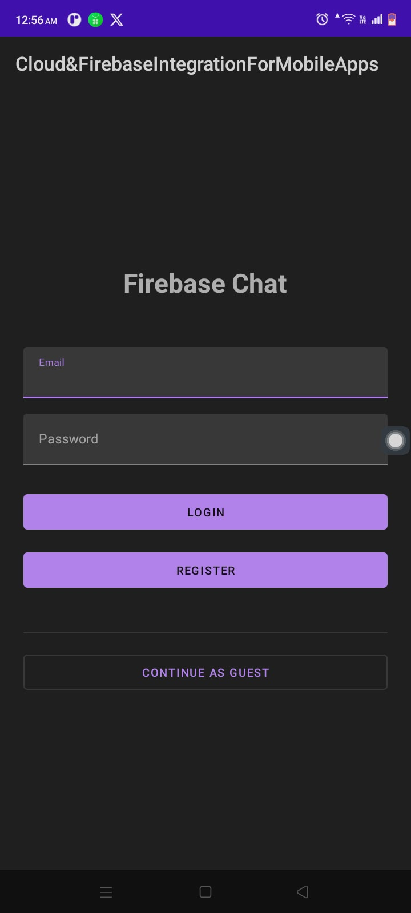
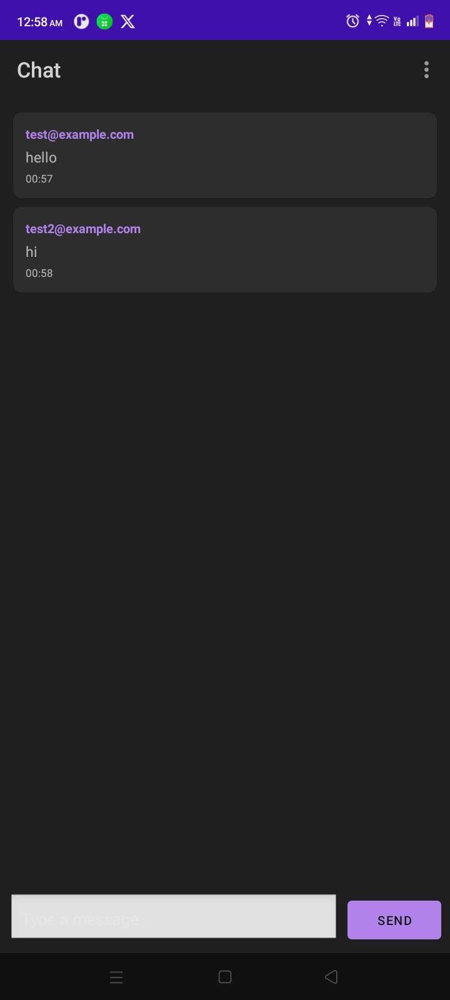
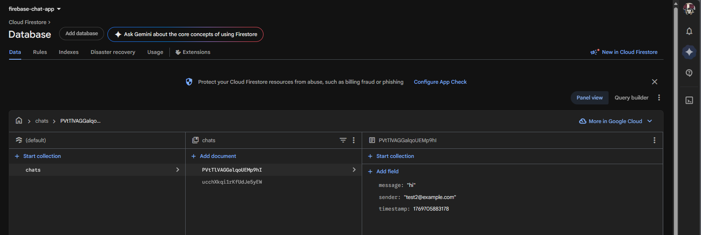

# 🔥 Firebase Chat Application

<div align="center">

[](https://firebase.google.com/)
[](https://kotlinlang.org/)
[](https://developer.android.com/)

**A fully functional real-time chat application demonstrating modern Android development with Firebase integration**

[Features](#-features) • [Screenshots](#-screenshots) • [Setup](#-quick-setup) • [Documentation](#-documentation) • [Usage](#-how-to-use)

</div>

---

## 📋 Table of Contents

- [Overview](#-overview)
- [Features](#-features)
- [Screenshots](#-screenshots)
- [Technologies](#-technologies)
- [Quick Setup](#-quick-setup)
- [How to Use](#-how-to-use)
- [Documentation](#-documentation)
- [Project Structure](#-project-structure)
- [Security](#-security)
- [Troubleshooting](#-troubleshooting)
- [Contributing](#-contributing)
- [License](#-license)

---

## 🎯 Overview

This is a **production-ready real-time chat application** built for Android that demonstrates:

✅ **Cloud Backend Integration** - Firebase as Backend-as-a-Service (BaaS)  
✅ **User Authentication** - Email/Password and Anonymous login  
✅ **Real-Time Database** - Instant message synchronization with Firestore  
✅ **Modern Android Development** - Kotlin, Material Design 3, ViewBinding  
✅ **Security Best Practices** - Firebase Authentication and security rules  

**Perfect for:** Learning Firebase integration, understanding real-time databases, and modern Android development practices.

---

## ✨ Features

### 🔐 **Authentication System**

- **Email/Password Registration** - Create secure accounts with email validation
- **Email/Password Login** - Secure authentication for returning users
- **Anonymous Login** - "Continue as Guest" without account creation
- **Session Management** - Persistent login state across app restarts
- **Logout Functionality** - Secure sign-out with menu option

### 💬 **Real-Time Chat**

- **Instant Messaging** - Messages appear immediately for all users
- **Live Synchronization** - Powered by Firestore real-time listeners
- **Message Display** - Shows sender, content, and timestamp
- **Auto-Scroll** - Automatically scrolls to newest messages
- **Persistent Storage** - All messages saved in cloud database
- **Offline Support** - Firestore caches data for offline access

### 🎨 **User Interface**

- **Material Design 3** - Modern, clean, and intuitive interface
- **Responsive Layouts** - Works on phones and tablets
- **Login Screen** - Email/password fields with three authentication options
- **Chat Screen** - Message list with input field and send button
- **Message Cards** - Styled cards showing sender info and timestamp
- **Error Handling** - User-friendly toast messages

---

## 📸 Screenshots

<div align="center">

### Login Screen
*Authentication interface with Email/Password and Guest login options*



---

### Chat Interface
*Real-time messaging with sender info and timestamps*



---

### Firestore Console
*Backend database showing stored messages in real-time*



---

### Login Error Handling
*User-friendly error messages for authentication issues*


</div>

---

## 🛠 Technologies

### **Core Stack**
- **Language:** Kotlin
- **Platform:** Android (Min SDK 24, Target SDK 36)
- **Build System:** Gradle with Kotlin DSL

### **Firebase Services**
- **Firebase Authentication** - User management and session handling
- **Cloud Firestore** - Real-time NoSQL database
- **Firebase Cloud Messaging** - Push notifications (configured)
- **Firebase BOM** - Centralized version management

### **Android Components**
- **Material Design 3** - Modern UI components
- **ViewBinding** - Type-safe view access
- **RecyclerView** - Efficient message list
- **ConstraintLayout** - Responsive layouts
- **Navigation Component** - App navigation

### **Architecture**
- **MVVM-inspired** - Separation of concerns
- **Repository Pattern** - Firebase as data source
- **Real-time Observers** - Firestore snapshot listeners

---

## 🚀 Quick Setup

### **Prerequisites**
- Android Studio (latest version)
- Android device or emulator
- Google account for Firebase
- Internet connection

### **5-Minute Setup**

1. **Clone the repository**
   ```bash
   git clone https://github.com/genandoy-hannahlorainne/DIT301_HLGenandoy_Act08
   cd CloudFirebaseIntegrationForMobileApps
   ```

2. **Create Firebase Project**
   - Go to [Firebase Console](https://console.firebase.google.com/)
   - Click "Add project" → Name it `firebase-chat-app`
   - Add Android app with package: `com.example.cloudfirebaseintegrationformobileapps`
   - Download `google-services.json`

3. **Add Configuration File**
   - Place `google-services.json` in `app/` folder
   ```
   CloudFirebaseIntegrationForMobileApps/
   └── app/
       └── google-services.json  ← Place here
   ```

4. **Enable Firebase Services**
   - **Authentication:** Enable Email/Password and Anonymous
   - **Firestore:** Create database in test mode

5. **Run the App**
   - Open project in Android Studio
   - Sync Gradle files
   - Click Run (▶️)

**📖 Detailed Setup:** See [Visual Setup Guide](documents/FIREBASE_SETUP_VISUAL_GUIDE.md)

---

## 📱 How to Use

### **First Time - Registration**

1. Launch the app
2. Enter email and password (min 6 characters)
3. Click **"REGISTER"** button
4. Success! Navigate to chat screen

### **Returning Users - Login**

1. Launch the app
2. Enter your credentials
3. Click **"LOGIN"** button
4. Navigate to chat screen

### **Guest Mode**

1. Launch the app
2. Click **"Continue as Guest"**
3. Start chatting anonymously

### **Sending Messages**

1. Type message in input field
2. Click **"Send"** button
3. Message appears instantly for all users

### **Logging Out**

1. Click menu icon (⋮) in top-right
2. Select **"Logout"**
3. Return to login screen

---

## 📚 Documentation

### **Quick Links**

| Document | Description | Time |
|----------|-------------|------|
| [START_HERE.md](documents/START_HERE.md) | Entry point - choose your path | 2 min |
| [QUICKSTART.md](documents/QUICKSTART.md) | Fast 5-minute setup | 5 min |
| [FIREBASE_SETUP_VISUAL_GUIDE.md](documents/FIREBASE_SETUP_VISUAL_GUIDE.md) | Step-by-step with screenshots | 20 min |
| [FIRESTORE_CONSOLE_GUIDE.md](documents/FIRESTORE_CONSOLE_GUIDE.md) | View and manage database | 10 min |
| [TROUBLESHOOTING.md](documents/TROUBLESHOOTING.md) | Common issues & solutions | As needed |
| [SUBMISSION_CHECKLIST.md](documents/SUBMISSION_CHECKLIST.md) | Pre-submission verification | 10 min |

### **Complete Documentation**

📑 **[Documentation Index](documents/DOCUMENTATION_INDEX.md)** - Access all 16 documentation files

**Topics Covered:**
- Firebase setup and configuration
- Authentication implementation
- Firestore database management
- Troubleshooting and debugging
- Security best practices
- Project architecture
- Submission guidelines

---

## 📂 Project Structure

```
CloudFirebaseIntegrationForMobileApps/
│
├── app/
│   ├── google-services.json              # Firebase configuration
│   ├── build.gradle.kts                  # App dependencies
│   │
│   └── src/main/
│       ├── AndroidManifest.xml           # App configuration
│       │
│       ├── java/.../cloudfirebaseintegrationformobileapps/
│       │   ├── LoginActivity.kt          # 🔐 Authentication (100 lines)
│       │   ├── ChatActivity.kt           # 💬 Chat interface (120 lines)
│       │   ├── ChatAdapter.kt            # 📋 Message adapter (50 lines)
│       │   └── Message.kt                # 📦 Data model (5 lines)
│       │
│       └── res/
│           ├── layout/
│           │   ├── activity_login.xml    # Login UI
│           │   ├── activity_chat.xml     # Chat UI
│           │   └── item_message.xml      # Message card
│           │
│           ├── menu/
│           │   └── chat_menu.xml         # Logout menu
│           │
│           └── values/
│               ├── strings.xml           # String resources
│               ├── colors.xml            # Color palette
│               └── themes.xml            # Material theme
│
├── documents/                            # 📚 16 documentation files
│   ├── START_HERE.md
│   ├── FIREBASE_SETUP_VISUAL_GUIDE.md
│   ├── FIRESTORE_CONSOLE_GUIDE.md
│   └── ... (13 more guides)
│
├── act9/                                 # 📸 Screenshots
│   ├── landing_page.jpg
│   ├── chats.jpg
│   ├── firestore_console.png
│   └── login_failed.jpg
│
├── build.gradle.kts                      # Project configuration
└── README.md                             # This file
```

**Total Code:** ~450 lines (Kotlin + XML)  
**Documentation:** 16 files, 25,000+ words

---

## 🔐 Security

### **Implemented Security Features**

✅ **Firebase Authentication**
- Industry-standard password hashing (bcrypt)
- Secure token-based sessions
- HTTPS-only communication
- Automatic token refresh

✅ **Firestore Security Rules**
```javascript
rules_version = '2';
service cloud.firestore {
  match /databases/{database}/documents {
    match /chats/{messageId} {
      // Only authenticated users can read/write
      allow read, write: if request.auth != null;
    }
  }
}
```

✅ **Input Validation**
- Email format validation
- Password minimum length (6 characters)
- Empty field checks
- Error messages for invalid input

✅ **Configuration Security**
- `google-services.json` excluded from version control
- API keys restricted in Firebase Console
- No hardcoded credentials

### **Production Recommendations**

For production deployment:

1. **Enhanced Security Rules** - Add user-specific permissions
2. **Rate Limiting** - Implement Firebase App Check
3. **Data Validation** - Validate message length and content
4. **Environment Separation** - Different Firebase projects for dev/prod
5. **Monitoring** - Enable Crashlytics and usage alerts

---

## 🐛 Troubleshooting

### **Common Issues**

#### ❌ App crashes on startup
```
Error: "Default FirebaseApp is not initialized"
```
**Solution:**
1. Verify `google-services.json` is in `app/` folder
2. Sync Gradle files
3. Clean and rebuild project

---

#### ❌ Authentication failed
```
Error: "There is no user record corresponding to this identifier"
```
**Solution:**
1. Use **REGISTER** button for new users (not LOGIN)
2. Verify Email/Password is enabled in Firebase Console
3. Check password is at least 6 characters

---

#### ❌ Messages don't appear
```
Error: "PERMISSION_DENIED: Missing or insufficient permissions"
```
**Solution:**
1. Verify Firestore database is created
2. Check security rules allow authenticated access
3. Ensure user is logged in

---

#### ❌ Build fails
```
Error: "Could not find com.google.firebase:firebase-..."
```
**Solution:**
1. Check internet connection
2. Sync Gradle files
3. Invalidate caches and restart

---

### **Need More Help?**

📖 **[Complete Troubleshooting Guide](documents/TROUBLESHOOTING.md)** - 20+ issues with solutions

---

## 🎓 Learning Outcomes

By studying this project, you will learn:

✅ **Cloud Backend Integration** - How BaaS platforms work  
✅ **User Authentication** - Implementing secure login systems  
✅ **Real-Time Databases** - NoSQL and live data synchronization  
✅ **Android Development** - Activities, RecyclerView, ViewBinding  
✅ **Software Architecture** - Separation of concerns and patterns  
✅ **Security Best Practices** - Authentication and data protection  

**Key Takeaway:** Modern mobile apps leverage cloud services to scale beyond the device, enabling real-time collaboration without managing custom servers.

---

## 🔮 Future Enhancements

### **Easy Additions** (Beginner-friendly)
- [ ] Display user's name instead of email
- [ ] Add message character limit
- [ ] Show "No messages yet" placeholder
- [ ] Implement dark mode theme
- [ ] Add sound effects for messages

### **Intermediate Features**
- [ ] User profiles with avatars
- [ ] Message timestamps in "time ago" format
- [ ] Delete/edit own messages
- [ ] Search messages functionality
- [ ] Export chat history

### **Advanced Features**
- [ ] Push notifications with FCM
- [ ] Private messaging between users
- [ ] Group chats with multiple rooms
- [ ] Image and file sharing
- [ ] Voice messages
- [ ] Online/offline status indicators
- [ ] Typing indicators
- [ ] Message read receipts
- [ ] End-to-end encryption

---

## 👥 Contributing

Contributions are welcome! Here's how:

1. Fork the repository
2. Create a feature branch (`git checkout -b feature/AmazingFeature`)
3. Commit your changes (`git commit -m 'Add AmazingFeature'`)
4. Push to the branch (`git push origin feature/AmazingFeature`)
5. Open a Pull Request

**Contribution Ideas:**
- Add features from "Future Enhancements"
- Improve documentation
- Fix bugs
- Add unit tests
- Optimize performance

---

## 📊 Project Statistics

- **Development Time:** 2-3 hours (including Firebase setup)
- **Lines of Code:** ~450 lines (Kotlin + XML)
- **Documentation:** 16 markdown files, 25,000+ words
- **Firebase Services:** 3 (Auth, Firestore, FCM)
- **Activities:** 2 main (Login, Chat)
- **Min SDK:** 24 (Android 7.0 Nougat)
- **Target SDK:** 36 (Latest)
- **APK Size:** ~8-10 MB

---

## 👤 Author

**Hannah Loraine Genandoy**
- GitHub: [@genandoy-hannahlorainne](https://github.com/genandoy-hannahlorainne)
- Repository: [DIT301_HLGenandoy_Act08](https://github.com/genandoy-hannahlorainne/DIT301_HLGenandoy_Act08)
- Course: Mobile Development (DIT301)

---

## 📄 License

This project is for educational purposes as part of Mobile Development coursework.

---

## 🙏 Acknowledgments

### **Technologies & Platforms**
- [Firebase](https://firebase.google.com/) - Backend-as-a-Service platform
- [Android Developers](https://developer.android.com/) - Official documentation
- [Kotlin](https://kotlinlang.org/) - Programming language
- [Material Design](https://material.io/) - Design system

### **Learning Resources**
- Firebase Documentation and Codelabs
- Android Developers Guide and Training
- Material Design Guidelines
- Stack Overflow Community

### **Tools Used**
- Android Studio - IDE
- Firebase Console - Backend management
- Git & GitHub - Version control
- Gradle - Build system

---

## 📞 Support

### **Having Issues?**
1. Check [TROUBLESHOOTING.md](documents/TROUBLESHOOTING.md)
2. Review [Firebase Setup Guide](documents/FIREBASE_SETUP_VISUAL_GUIDE.md)
3. Search existing GitHub issues
4. Contact your instructor

### **Found a Bug?**
Open an issue on GitHub with:
- Description of the problem
- Steps to reproduce
- Expected vs actual behavior
- Screenshots if applicable
- Device/emulator information

---

<div align="center">

## ⭐ Show Your Support

If this project helped you learn Firebase and Android development:

⭐ **Star this repository**  
🍴 **Fork it for your own projects**  
📢 **Share it with classmates**  
💬 **Provide feedback**

---

**Built with ❤️ for Mobile Development Education**

**Happy Coding!** 🚀📱💬

</div>
